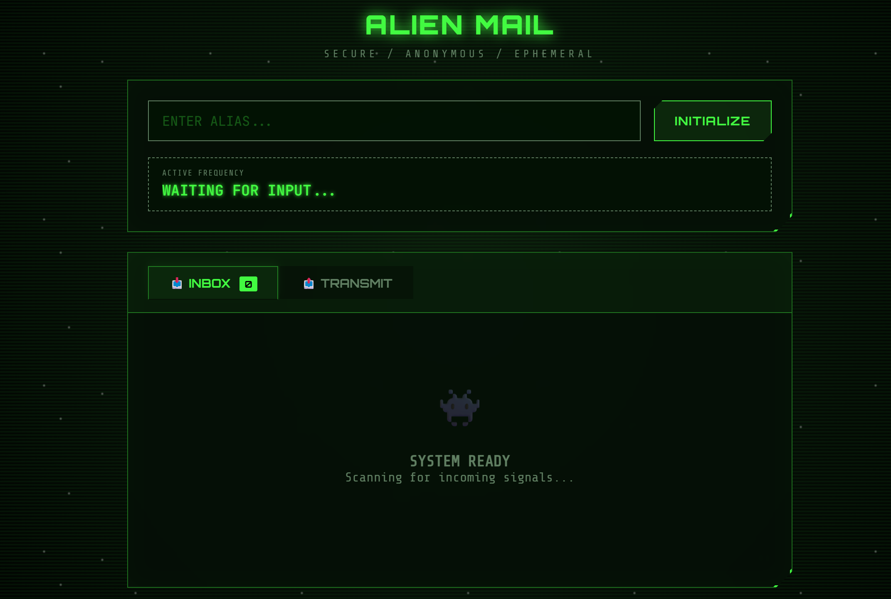

# Temp Mail 临时邮箱服务

Temp Mail 是一个即开即用的临时邮箱系统，内置 SMTP 收件服务、可视化 Web 界面以及 RESTful API。服务会在内存中保存指定时间的邮件副本，适合测试注册流程、一次性消息收发等临时场景。



## 功能亮点
- 一键生成随机或自定义前缀的临时邮箱地址，自动展示剩余有效期
- Web 控制台实时轮询邮件、支持消息详情页与 `EML` 源文件下载
- REST API 覆盖地址创建、邮件列表、邮件详情与发送能力
- 内置 SMTP 服务器接收邮件，支持 RFC 标准解析、Snippet 提取、TTL 自动清理
- 内置 SMTP 客户端可直接按域名 MX 投递（适合内网或自管 IP 测试环境）

## 架构概览
- `HTTP`：`internal/httpapi` 提供 REST API + Web UI
- `SMTP Server`：`internal/smtpserver` 负责监听邮件并写入存储
- `SMTP Client`：`internal/smtpclient` 直接向目标域 MX 发送邮件
- `Storage`：`internal/storage` 的内存存储，按 `MESSAGE_TTL` 自动清理
- `cmd/temp-mail/main.go`：加载配置、启动 HTTP/SMTP 服务、处理优雅退出

## 快速开始

使用 Docker 快速部署：

```bash
docker run -d --name temp-mail \
  -p 8080:8080 \
  -p 25:25 \
  -e HTTP_ADDR=:8080 \
  -e SMTP_ADDR=:25 \
  -e DOMAIN=example.com \
  -e MESSAGE_TTL=30m \
  -e TZ=Asia/Shanghai \
  neixin/temp-mail:latest
```

或使用 Docker Compose：

```yaml
version: '3.8'

services:
  temp-mail:
    image: neixin/temp-mail:latest
    container_name: temp-mail
    restart: unless-stopped
    ports:
      - "8080:8080"   # HTTP Web/API
      - "25:25"       # SMTP 服务
    environment:
      - HTTP_ADDR=:8080
      - SMTP_ADDR=:25
      - DOMAIN=example.com
      - MESSAGE_TTL=30m
      - TZ=Asia/Shanghai
```

启动后访问 `http://服务器IP:8080` 即可使用 Web 界面。

**DNS 记录配置**：

假设您的域名为 `example.com`，服务器 IP 为 `1.2.3.4`，需添加以下 DNS 记录：

| 类型 | 主机记录 | 记录值 | 说明 |
| ---- | -------- | ------ | ---- |
| A    | @        | 1.2.3.4 | 将域名指向服务器 IP |
| MX   | @        | example.com (优先级 10) | 指定邮件服务器，用于接收邮件 |
| TXT  | @        | v=spf1 a mx ~all | SPF 记录，声明允许该服务器发送邮件 |
| TXT  | _dmarc   | v=DMARC1; p=none; rua=mailto:admin@example.com | DMARC 策略（可选，建议配置） |

> **提示**：SPF 和 DMARC 记录可提升发件信誉，减少被收件方拒收或标记为垃圾邮件的概率。

**注意**：
- 绑定 25 端口需要 root 权限，确保服务器防火墙和 ISP 允许该端口
- `DOMAIN` 环境变量需与 MX 记录的域名一致

## 环境变量

| 变量名        | 默认值      | 说明 |
| ------------- | ----------- | ---- |
| `HTTP_ADDR`   | `:8080`     | HTTP 服务监听地址 |
| `SMTP_ADDR`   | `:2525`     | SMTP 服务监听地址，映射到容器外可改为 `:25` |
| `DOMAIN`      | `tmp.local` | 系统生成邮箱地址使用的域名（可填公网 IP 或真实域名） |
| `MESSAGE_TTL` | `30m`       | 邮件保留时间，使用 Go `time.ParseDuration` 语法（如 `10m`、`1h`） |
| `TZ`          | `UTC`       | 时区设置（Docker 镜像默认 `Asia/Shanghai`） |

## HTTP API

### 1. 创建临时邮箱
- `POST /api/address?local=custom`（`local` 可选）
- 响应：
  ```json
  {
    "address": "custom@tmp.local",
    "local": "custom",
    "ttl": 30
  }
  ```

### 2. 查询邮箱下的邮件
- `GET /api/messages/{local}`
- 响应示例：
  ```json
  [
    {
      "id": "c9f8b0d0...",
      "address": "custom@tmp.local",
      "from": "\"GitHub\" <noreply@github.com>",
      "subject": "Verify your email",
      "snippet": "Hi there, please verify...",
      "createdAt": "2025-10-18T07:21:10.123Z",
      "expiresAt": "2025-10-18T07:51:10.123Z"
    }
  ]
  ```

### 3. 获取单封邮件
- `GET /api/messages/{local}/{id}`
  - JSON 详情同上
- `GET /api/messages/{local}/{id}?format=raw`
  - 返回 `message/rfc822` 原始内容，可下载 `EML`

### 4. 发送邮件
- `POST /api/send`
- 请求体：
  ```json
  {
    "from": "sender",          // 会自动补全为 sender@DOMAIN
    "to": ["target@example.com"],
    "subject": "Hello",
    "body": "Plain text body",
    "html": "<p>HTML body</p>"
  }
  ```
- 仅在 `DOMAIN` 下存在对应地址时发送，若不存在会自动创建。邮件通过 MX 记录直接投递，对公共邮箱服务可能因 IP 信誉被拒收。

## Web 界面
- 访问 `/` 即可创建邮箱、复制地址、查看剩余有效期
- 前端使用轮询获取新邮件，收到新邮件时有新标记与倒计时
- 邮件详情页支持 iframe 渲染 HTML、纯文本回退、EML 下载
- 内置发送表单，可直接调用 `/api/send`

## 开发与测试
- 代码风格：Go 1.22，使用标准库和 `github.com/emersion/go-smtp` / `go-sasl`
- 运行全部测试：
  ```bash
  go test ./...
  ```
- Storage 层为纯内存实现，开发时可通过调整 `MESSAGE_TTL` 验证过期清理逻辑

## 注意事项
- 邮件仅缓存在内存中，服务重启即丢失，不适合长期存储
- `MESSAGE_TTL` 需带单位（如 `30m`），纯数字将被视为纳秒
- 直接使用公网 IP 投递邮件时，请确认发件 IP 信誉，大型邮箱服务可能拒收
- 默认未启用 HTTPS/STARTTLS，如需公网暴露请在网关或反向代理层加上 TLS

欢迎根据需求扩展持久化存储、多节点部署、权限控制等能力。
